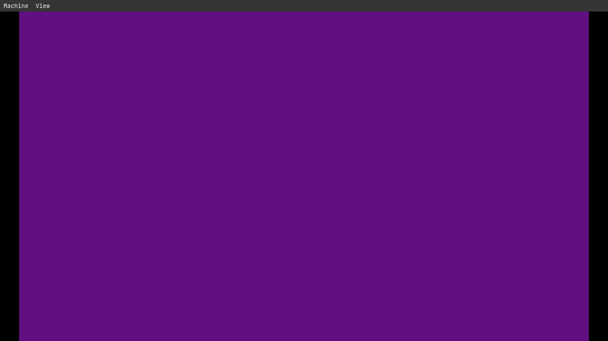
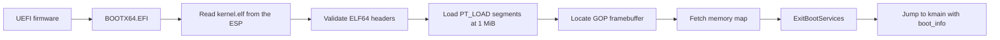

# rolnix

**A from-scratch x86-64 UEFI bootloader and kernel, built to stay small, readable, and free.**

[](LICENSE)
[](#status)
[](#status)
[](#repository-layout)

rolnix boots a machine with no help from GRUB, no vendored UEFI libraries, and no standard library. The bootloader talks to UEFI firmware through hand-written protocol definitions, loads a kernel from disk by parsing its ELF headers, shuts the firmware down, and jumps into the kernel with a defined handoff structure. Every line between power-on and the kernel's first instruction is in this repository, and every step is meant to be understood.

> rolnix is an early-stage educational and experimental project. It is **not** usable as an operating system yet. See [Status](#status) for exactly what works.



*The kernel running in QEMU. The bootloader draws nothing at this stage. Every purple pixel is written by kernel code.*

---

## Table of contents

- [Why this exists](#why-this-exists)
- [Status](#status)
- [How it boots](#how-it-boots)
- [The boot protocol](#the-boot-protocol)
- [Quick start](#quick-start)
- [Repository layout](#repository-layout)
- [Design goals](#design-goals)
- [Known limitations](#known-limitations)
- [Roadmap](#roadmap)
- [Contributing](#contributing)
- [License](#license)
- [Contact](#contact)

---

## Why this exists

Most operating system tutorials stop at a 512-byte BIOS boot sector, or hand the hard parts to a prebuilt bootloader. rolnix does the opposite: it starts from modern UEFI firmware and builds the entire boot path in the open, in small steps, with each piece verified before the next one is added.

The goal is a kernel that is predictable, small enough to run on very limited hardware, and free for anyone to use, study, and modify.

## Status

Pre-alpha. Tested in QEMU with OVMF firmware only. Nothing has been run on physical hardware yet.

| Component                                   | State   |
| ------------------------------------------- | ------- |
| UEFI application (PE32+) built with clang   | Working |
| Firmware text console output                | Working |
| Memory map retrieval (`GetMemoryMap`)       | Working |
| Graphics Output Protocol framebuffer        | Working |
| File system access (read `kernel.elf`)      | Working |
| ELF64 validation and segment loading        | Working |
| `ExitBootServices` with stale-key retry     | Working |
| Handoff to kernel across calling conventions | Working |
| Kernel with its own stack                   | Planned |
| Memory map passed to the kernel             | Planned |
| Kernel text console                         | Planned |
| Interrupts, paging, allocator               | Planned |

Today the kernel does one thing: it receives the framebuffer from the bootloader and fills the screen with a solid color, which proves the entire chain from firmware to kernel works.

## How it boots



1. Firmware finds `\EFI\BOOT\BOOTX64.EFI` on the EFI System Partition and runs it.
2. The bootloader opens `kernel.elf` from the same volume and reads it into a buffer.
3. Every field it relies on is checked before use: magic, class, machine, type, and that all program headers and segment data lie inside the file. Offset arithmetic is written to avoid integer overflow.
4. Each `PT_LOAD` segment is claimed from firmware at its exact physical address, copied in, and zero-filled up to its in-memory size.
5. The framebuffer details are copied into a `boot_info` structure while firmware services still exist.
6. The memory map is fetched and `ExitBootServices` is called immediately, retrying if the map key goes stale. No allocation or console call happens in between.
7. The bootloader calls the kernel's entry point. From this moment, firmware boot services are gone and the kernel owns the machine.

### Two calling conventions, one bridge

UEFI firmware uses the Microsoft x64 calling convention, so the bootloader is compiled for a Windows target and produces a PE file. The kernel is a freestanding ELF built for System V, where the first argument travels in a different register. The bootloader calls the kernel through a function pointer type marked `__attribute__((sysv_abi))`, which makes the compiler place the `boot_info` pointer where the kernel expects it.

## The boot protocol

The contract between bootloader and kernel is a single structure. Both sides define it identically.

```c
struct boot_info {
    uint32_t *fb;      /* framebuffer base address              */
    uint32_t  width;   /* horizontal resolution in pixels       */
    uint32_t  height;  /* vertical resolution in pixels         */
    uint32_t  stride;  /* pixels per scanline (may exceed width) */
};
```

The kernel entry point is `void kmain(struct boot_info *info)` and must never return. The memory map will be added to this structure when the kernel needs to manage RAM.

## Quick start

### Requirements

- `clang` and LLVM's linkers: `lld-link` (for the bootloader) and `ld.lld` (for the kernel)
- `make`
- `qemu-system-x86_64`
- OVMF UEFI firmware images

On Arch-based systems:

```bash
sudo pacman -S --needed clang lld make qemu-desktop edk2-ovmf
```

Package names and firmware paths differ on other distributions. If your OVMF files live somewhere else, change the `OVMF_CODE` line in `bootloader/Makefile` and copy your distribution's variable store in the next step.

### Build and run

```bash
git clone https://github.com/roland-yegon/rolnix.git
cd rolnix
```

QEMU needs a writable copy of the firmware variable store. It is ignored by git, so create it once:

```bash
cp /usr/share/edk2/x64/OVMF_VARS.4m.fd bootloader/
```

Build the kernel and copy it into the fake EFI System Partition:

```bash
make -C kernel install
```

Build the bootloader and boot it in QEMU:

```bash
make -C bootloader run
```

**Expected result:** the screen flashes a few lines of boot output, then turns solid purple. Purple means the kernel ran: the bootloader never draws anything in the final stage, so every purple pixel was written by code inside `kernel.elf`.

## Repository layout

```
rolnix/
  bootloader/        UEFI bootloader (PE32+, x86-64)
    main.c           firmware protocols, ELF loader, handoff
    Makefile         build and run targets
    .clangd          editor configuration for the UEFI target
  kernel/            the kernel (ELF64, freestanding)
    kernel.c         kernel entry point
    linker.ld        load address and section layout
    Makefile         build and install-to-ESP targets
  LICENSE            GPL-2.0
  README.md
```

The QEMU "disk" is simply the `bootloader/esp/` directory, which QEMU presents to the firmware as a FAT volume. `make -C kernel install` places `kernel.elf` there.

## Design goals

These are goals, not claims. Each one is a constraint applied while writing code.

- **Predictable.** Small, explicit code paths. No hidden allocation, no surprising control flow.
- **Runs on very limited hardware.** No standard library, no runtime, and a footprint measured in kilobytes. The whole kernel today is 109 bytes of machine code.
- **Safe by construction where possible.** Inputs from outside the bootloader's control, such as the kernel file, are validated before use. Arithmetic on untrusted sizes is written to avoid overflow.
- **Secure.** Minimal attack surface by keeping the amount of code small. Secure Boot support is on the roadmap and is not implemented yet.
- **Readable.** Every structure and magic number is named and explained. The code is meant to be learned from.
- **Free.** Anyone may use, study, modify, and redistribute it, and modified versions stay open source.

## Known limitations

Documented here so nobody is surprised by them.

- The file system is located with the first volume firmware reports, which is correct in QEMU but not guaranteed on machines with several disks. The correct fix is to use the `LoadedImage` protocol to find the device the bootloader came from.
- The kernel file is read into a fixed 64 KiB buffer. The correct fix is to query the file size first.
- The kernel runs on the stack the firmware provided, which is memory the firmware considers reclaimable. The kernel must switch to its own stack before doing real work.
- The kernel is linked at a fixed physical address of 1 MiB. A kernel with higher-half virtual addresses will need page tables set up by the bootloader.
- The memory map is fetched for the `ExitBootServices` call but not yet passed to the kernel.
- Only x86-64 UEFI is supported. There is no BIOS or legacy boot path.
- Tested in QEMU only.

## Roadmap

- [x] Build a PE32+ UEFI application with clang and lld
- [x] Print text through the firmware console
- [x] Read the UEFI memory map
- [x] Draw to the GOP framebuffer
- [x] Exit boot services safely
- [x] Read files from the EFI System Partition
- [x] Parse and validate ELF64, load segments
- [x] Hand off to a separate kernel
- [ ] Give the kernel its own stack
- [ ] Pass the memory map to the kernel
- [ ] Locate the boot device with `LoadedImage`
- [ ] Kernel text console with a built-in font
- [ ] GDT and IDT, exception handlers
- [ ] Physical memory manager
- [ ] Paging and a higher-half kernel
- [ ] Timer and interrupt-driven scheduling groundwork
- [ ] Run on real hardware
- [ ] Secure Boot compatibility

## Contributing

Issues and pull requests are welcome, including questions about why something is the way it is.

- Keep changes small and focused, one idea per commit.
- Match the existing style: explicit, commented where the reason is not obvious, no unexplained constants.
- Every source file carries an SPDX license header. New files should too.
- If a change affects the boot protocol, update both sides and this document in the same commit.
- By contributing, you agree that your contribution is licensed under GPL-2.0-only.

## License

rolnix is licensed under the **GNU General Public License, version 2 only** (`GPL-2.0-only`). Anyone may use, modify, and distribute it, including commercially. If you distribute a modified version, you must make its source available under the same license. See [LICENSE](LICENSE) for the full text.
